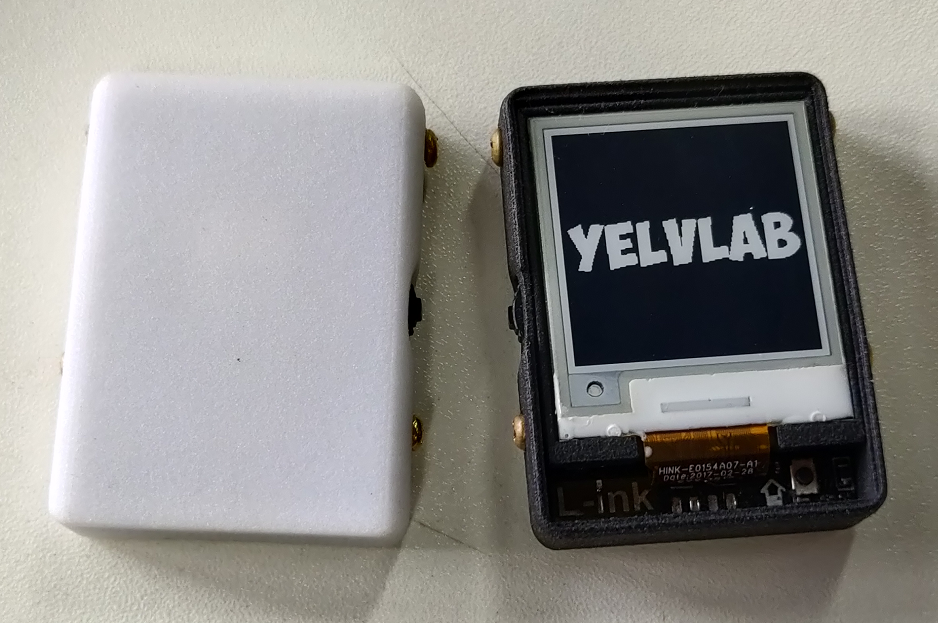
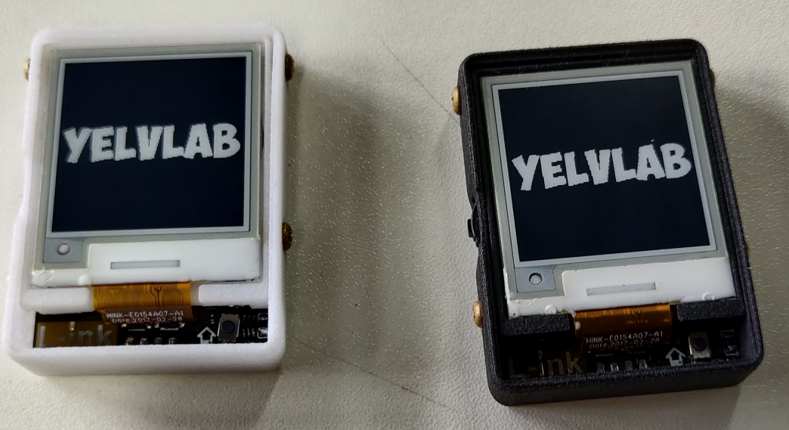

# L-ink_card_Collection
> 这个仓库是对于稚晖君的L-ink_card项目相关资料整理备份，包括原项目以及网友的贡献。如果有知道大佬

## 文件介绍

- L-ink_Card_Initially 是[稚晖君](https://www.zhihu.com/people/zhi-hui-64-54)的L-ink_Card开源项目的原地址，为了方便收录，我作为子模块添加进来。
- L-ink_Card_FourCardsVersion 是稚晖项目的一个组团开车群里面的大佬修改的四卡版本。[Github地址](https://github.com/simonire/L-ink_Card)
- L-ink_Shell_Modified 是同样群里面大佬们开车时候的修改版本的外壳文件
- L-ink_Modified_Code 开车群大佬【三乘四】修改版本的代码，主要修复了不同版本的水墨屏的驱动问题，同时加入了测试代码。

上面这段修改过的代码也是我这个仓库的主要目的，实在没有找到这个大佬的github仓库。首先非常感谢这些大佬的无私奉献，其次再声明一遍，并非本人作品，只是为了自己方便查阅，同时方便其他人寻找，才上传github的，如果上述作者标注错误，请指出。

最后放两张我的成品，两个原汁原味的稚晖原版L-ink_Card(亚克力上盖还没搞)。实在是我看到这些大佬的修改作品的时候我都已经焊接完了，等后面有时间再继续搞。

